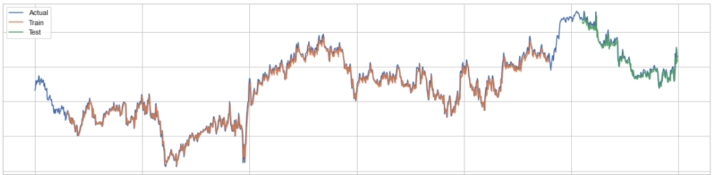

# Telkom Stocks Analysis
> A time series analysis project using stocks data from Telkom, an Indonesian multinational telecommunications conglomerate.

#### -- Project Status: [Completed]

## Project Description
After finishing Kaggle's amazing time series course, it only make sense to pick up a project related to the topic. I decided to explore stock price prediction ideas since it is perhaps the simplest form of a time series project out there. However, instead of picking up the popular or hot company stocks (like AAPL, Tesla, etc.), I thought it would be best to analyze a local public company close to home, namely Telkom Indonesia. Telkom Indonesia is a multinational telecommunications conglomerate and is one of the most popular stocks listed in the Indonesia Stocks Exchange. In this project, I will be using Telkom's stock data from 2016 to 2021 to apply time series analysis techniques as well as creating a stacked LSTM model to learn and forecast the data.

### Methods Used
* Web Scraping
* Time Series Data Preprocessing
* Time Series Data Visualization (Moving Averages, Decompostion, Correlation)
* Long Short-Term Memory Neural Networks 

### Technologies
* Python
* BeautifulSoup4
* Pandas
* Matplotlib, Seaborn
* Tensorflow
* Scikit-learn

### Data
The Telkom stocks data was scraped using Beatiful Soup from the [Yahoo Finance website](https://finance.yahoo.com/quote/TLKM.JK/) and 1260 Data points was obtained comprising of stock details from 2 November 2016 to 2021. 

## Preprocessing

## LSTMs

## Result

